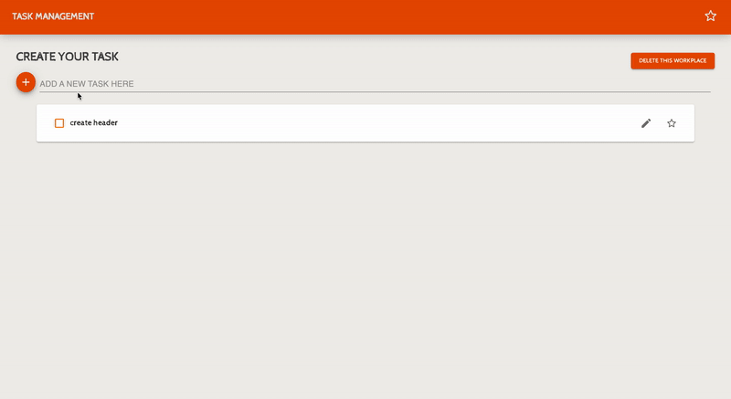

# Task Management App

Task Management App is a CRUD application that you can create, read, update, and delete tasks.

<<<<<<< HEAD

=======

>>>>>>> cb80071635c12d3f86b4abe2726e0708501f2145

### Features

- CRUD application
- Bookmark function
- You can delete all tasks at once

### Tech Stack

HTML5, CSS3, JavaScript, React, Context API, Material UI

### Website

Check the website: [DEMO](https://task-management-phi.vercel.app/)
